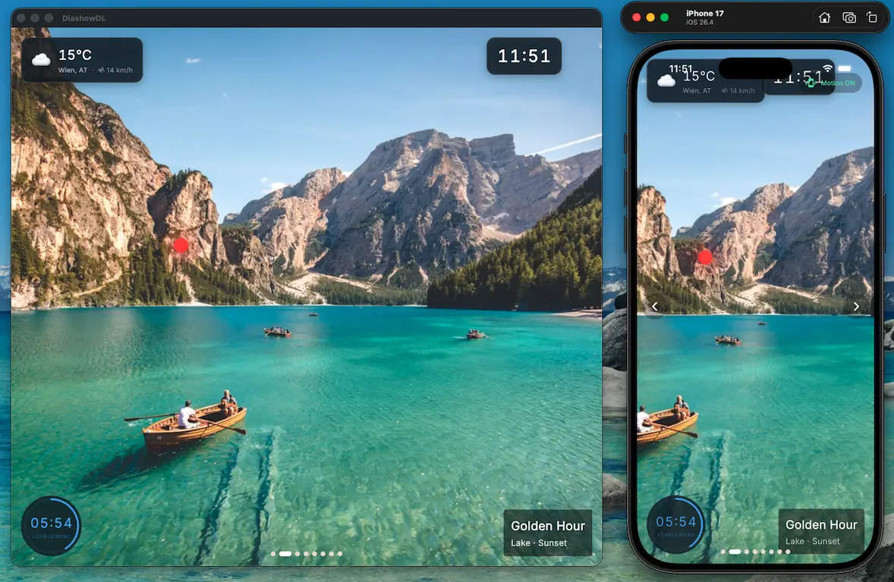

# DiashowDL — public docs and integration clients



Public companion repo for **DiashowDL**, a cross-platform Flutter slideshow
player that drives shows written in the **Diashow Description Language
(DDL v1.0)**. This repo does not contain the app itself — only the
material a third party needs to write DDL shows or build integrations:
the DDL specification, JSON Schema, REST API and sensor interface docs,
and reference client implementations in seven languages.

## What's in this repo

| Path | Purpose |
|------|---------|
| [`DDL_specification.html`](DDL_specification.html) | Full DDL v1.0 specification |
| [`ddl-schema.json`](ddl-schema.json) | JSON Schema for `.ddl.json` show files |
| [`api.md`](api.md) | REST API documentation |
| [`sensor.md`](sensor.md) | Sensor interface specification |
| [`api/`](api/) | Reference REST API clients (Python, Dart, Go, Node.js, C#, Java, ESP32) |
| [`sensor/`](sensor/) | Reference sensor-node implementations (Python, Dart, Go, Rust, ESP32) |
| [`diashows/`](diashows/) | Example DDL shows — a plain `.ddl.json` and a packaged `.ddlz` |

## REST API

The DiashowDL Display Server exposes an HTTPS REST API for third-party remote
control: upload a DDL show, start playback, advance/go-back/stop, and a few
maintenance endpoints.

```
Base URL:  https://<display-ip>:9134
Auth:      X-Api-Key: <your-api-key>
TLS:       device-unique self-signed certificate (clients must skip verification)
```

Setup in the app: **Settings → General Configuration**, enter an API key
(min. 8 chars, no spaces), enable **API Interface Active**, then start the
**Display Server**. The API starts automatically on port `9134`.

See [`api.md`](api.md) for the full endpoint list, payloads, and `curl`
examples.

## Reference clients

Each `api/<lang>/` directory is a self-contained client that uploads a DDL
show and drives playback over the REST API. They all take the same three
arguments: the display's IP address, a path to a `.ddl.json` (or `.ddlz`)
file, and the API key.

| Language | Run | Build |
|----------|-----|-------|
| [Python](api/python/) | `python api_demo.py <ip> <file> <key>` | — |
| [Dart](api/dart/) | `dart bin/api_demo.dart <ip> <file> <key>` | `dart compile exe bin/api_demo.dart -o diashow-cli` |
| [Go](api/go/) | `go run main.go <ip> <file> <key>` | `go build -o diashow-cli` |
| [Node.js](api/nodejs/) | `node index.js <ip> <file> <key>` | — |
| [C#](api/csharp/) | `dotnet run -- <ip> <file> <key>` | `dotnet build` |
| [Java](api/java/) | `java -jar target/api-demo-1.0-SNAPSHOT.jar <ip> <file> <key>` | `mvn clean package` |

The Python directory ships three variants:

- `api_demo.py` — arrow-key remote control.
- `api_hand_demo.py` — webcam hand-gesture control via MediaPipe (experimental).
- `api_voice_demo.py` — microphone voice-command control via Vosk (experimental).

### ESP32 hardware controllers

Two Arduino sketches in [`api/esp32/`](api/esp32/) turn an ESP32 into a
physical presenter remote that talks to the Display Server over WiFi.

| Sketch | Input |
|--------|-------|
| [`buttons/`](api/esp32/buttons/) | GPIO push-buttons (Next / Previous / Stop) |
| [`grove_gesture/`](api/esp32/grove_gesture/) | Seeed Grove Gesture Sensor (PAJ7620U2) |

Before flashing, copy `secrets.h.example` → `secrets.h` and fill in your WiFi
SSID, password, display IP, and API key. `secrets.h` is gitignored so it
won't be committed.

## Sensor interface

DiashowDL can display real-time environment data (temperature, humidity,
pressure, IAQ, CO2, …) from network-attached I²C sensors. The protocol is
intentionally minimal so any device — ESP32, Raspberry Pi, custom hardware —
can implement it:

- **UDP discovery:** the app broadcasts `DIASHOW_SCAN` on UDP port `9133`;
  sensor nodes reply with a JSON identification packet.
- **Data:** sensor data is fetched over **HTTPS on port `9132`**, authenticated
  with an `X-Api-Key` header.

See [`sensor.md`](sensor.md) for the full specification (discovery payload,
data schema, error handling). Reference sensor-node implementations live in
[`sensor/`](sensor/):

| Language | Path | Notes |
|----------|------|-------|
| [Python](sensor/python/) | `sensor/python/sensor_node.py` | Linux, reads I²C via `smbus2` |
| [Dart](sensor/dart/) | `sensor/dart/bin/` | CLI, `dart compile exe` for a static binary |
| [Go](sensor/go/) | `sensor/go/main.go` | Linux build reads real I²C; other platforms get a stub |
| [Rust](sensor/rust/) | `sensor/rust/src/` | `cargo build --release` |
| [ESP32](sensor/esp32/) | `sensor/esp32/esp32.ino` | Arduino sketch, on-device HTTPS with self-signed cert |

## Example shows

The [`diashows/`](diashows/) directory contains two ready-to-play examples
that exercise the two supported show formats:

| File | Format | What it demonstrates |
|------|--------|----------------------|
| [`widget_demo.ddl.json`](diashows/widget_demo.ddl.json) | Plain DDL JSON | Widget overlays (clock, timer, weather), mixed slide types — image, video, Lottie, web, PDF — and per-slide captions/transitions. References remote URLs and `asset://` resources bundled in the app. |
| [`amphibia.ddlz`](diashows/amphibia.ddlz) | Packaged ZIP bundle | A self-contained show: 18 amphibian photos plus the `.ddl.json` packed into a single `.ddlz` archive (no network required). Useful as an upload target for the REST API clients. |

A `.ddl.json` file is a single JSON document validated against
[`ddl-schema.json`](ddl-schema.json). A `.ddlz` is a ZIP archive bundling the
JSON together with its referenced media (images, videos, Lottie files, …)
under a `diashows/` and `images/` layout — pick `.ddlz` when you want the
show to run offline or be transferred as one file.

Load a show in the app via **Library → Import**, or push it to a running
Display Server with any of the reference clients:

```bash
# Python
python api/python/api_demo.py <ip> diashows/amphibia.ddlz <key>

# Dart
dart api/dart/bin/api_demo.dart <ip> diashows/widget_demo.ddl.json <key>
```

## About the DiashowDL app

DiashowDL is a Flutter implementation of DDL v1.0 with cross-platform
playback (iOS, Android, macOS, Windows, Linux). It supports image, video,
Lottie, PDF, and web slides; 14 transition types; Ken Burns pan-and-zoom;
caption and widget overlays (clock, countdown, timer, weather, sensor, logo);
and a remote presenter sync mode over SSL WebSockets. Shows can be authored
visually in the app's editor or written by hand against the JSON Schema in
this repo.

## License

Released under the MIT License — see [LICENSE](LICENSE).
